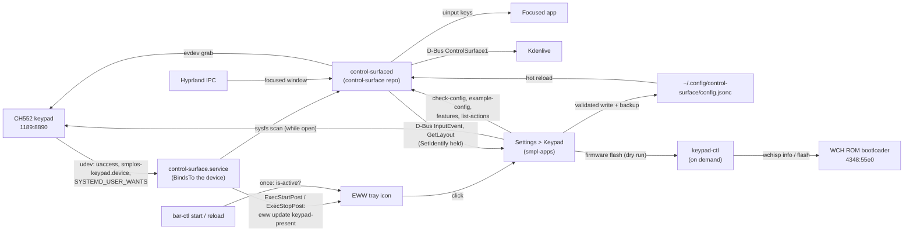
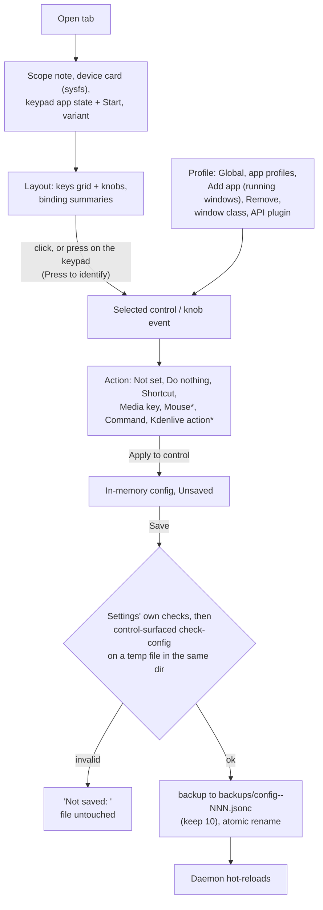

# Macro keypads (CH552) in smplOS

Status: **implemented for development, flashing is a dry run.** The keypad
daemon's own repository is not published yet, so its package recipe is parked.
The daemon has since delivered the Settings API that this design asked for
(`org.smplos.ControlSurface1`, see its `docs/dbus-settings-api.md`); Settings
already uses its live input, identify mode, feature list and Kdenlive catalog.
See [open decisions](#open-decisions) and the
[daemon API requests](#daemon-api-requests).

smplOS supports the family of cheap CH552 macro keypads (3 to 16 keys, 0 to 3
knobs; USB `1189:8890`). Plug one in and:

* it works: udev starts the keypad app (`control-surfaced`), which applies your
  mapping. Unplug it and the app stops again. **With no keypad plugged in,
  nothing keypad related runs** (see [footprint](#lifecycle-and-footprint));
* a keypad icon appears in the EWW bar while it is connected. Click it to open
  **Settings → Keypad**;
* Settings maps keys and knobs at three levels:
  1. **Generic mapping:** keyboard shortcuts, media keys, commands, and mouse
     buttons once the daemon supports them.
  2. **Per-app profiles:** while an app has focus, its own mapping applies;
     unset controls fall back to Global.
  3. **API plugins:** apps with a real control API are driven through it, not
     through fake keystrokes. Kdenlive is first, over its D-Bus
     `org.kde.kdenlive.ControlSurface1` interface. Plugins are code in the
     daemon, not key remaps.
* a step-by-step wizard installs the open firmware: unplug, hold the top-left
  key, plug in, flash, replug, test every input.

## Which keypads work

Only **CH552-based macro keypads with USB ID `1189:8890`**: the inexpensive
"MINI KeyBoard"-style pads sold under many names, with 3 to 16 keys and up to 3
knobs, usually configured on Windows with a "MINI KeyBoard" vendor app. To tell
whether yours is one, plug it in and open **Settings → Keypad**: a supported
keypad shows as connected (and the bar shows the keypad icon). In a terminal:

```bash
keypad-ctl present && echo "supported keypad connected"
# or, with usbutils installed (not part of smplOS by default):
lsusb -d 1189:8890
```

`lsusb` lists it as `1189:8890` (vendor "Acer Communications & Multimedia" in
the USB ID database; the product name varies). The ID is what counts. Pads with other IDs
(for example the CH57x-based `1189:8840`/`8842` boards, QMK/VIA keypads or
Stream Deck-style devices) are not handled and don't appear in Settings. The
Settings tab states this at the top and links here.

## Architecture



| Piece | Lives in | Role |
|---|---|---|
| `control-surfaced` | control-surface repository (separate) | Grabs only `1189:8890`, follows the focused window, applies JSONC profiles, Kdenlive plugin |
| Open firmware | control-surface `firmware/` (fork of CH552-OpenMacroPad, CC BY-SA 3.0) | Self-describing keypad firmware, same VID:PID |
| `keypad-ctl` | `src/shared/bin/keypad-ctl` | On-demand tool: detection (`status`, `present`) and firmware list and flash. Never runs in the background |
| udev rules | `src/shared/system/udev/70-ch552-macropad.rules`, `71-wch-isp-bootloader.rules` | Access, the `smplos-keypad.device` unit, start on plug-in |
| User unit | `src/shared/configs/systemd/user/control-surface.service` | Runs the keypad app only while a keypad is plugged in; sets the bar icon |
| Bar icon | `src/shared/eww/eww.yuck` (`defvar keypad-present`, `tray-keypad`), `bar-ctl`, `icons/status/keypad.svg` | Visible only while the keypad app runs |
| Settings tab | smpl-apps `settings/src/keypad/`, `settings/ui/main.slint` (tab 11) | Status, layout, mapping editor, firmware wizard |
| Packaging | `src/shared/pkgbuilds/control-surface/`, `packages-aur.txt` (`wchisp`) | Daemon recipe (parked) and the flasher |
| Migration | `migrations/20261007-123000-macro-keypad-support.sh` | Existing installs: udev rules, icon, unit (never enabled) |

Settings code lives in smpl-apps, like every native app. This repository
carries the system integration only, and never vendors the daemon's source.

## Detection and firmware identity

Detection reads sysfs attributes only (`/sys/bus/usb/devices`): it never opens
a keypad and never touches any other device. Settings does it itself while its
Keypad tab is open; `keypad-ctl status` does the same for scripts:

```json
{"state":"ready",
 "devices":[{"path":"1-5","vid":"1189","pid":"8890","manufacturer":"OpenMacroPad",
   "product":"Control Surface 15+3","serial":"key153","bcd":"0200","firmware":"open",
   "firmware_type":"control-surface","firmware_label":"Open firmware (control-surface)",
   "layout":{"board":"sy181-15k3e","keys":15,"knobs":3}}],
 "bootloaders":[]}
```

The rules are the daemon's own (`usbinfo.cpp`):

| Firmware (daemon name) | How it's recognized | Layout |
|---|---|---|
| `control-surface` (ours) | manufacturer `OpenMacroPad`, product `Control Surface K+N` | Self-described: `K+N` in the product string (`15+3` is `sy181-15k3e`); version from bcdDevice |
| `openmacropad` | manufacturer `SY181` (EpicLPer's builds) | Chosen in Settings |
| `stock` | manufacturer `wch.cn` (product `CH552`) | Chosen in Settings |
| `unknown` | any other `1189:8890` | Chosen in Settings |

bcdDevice carries major and minor only, so sysfs says 2.0 for firmware 2.0.1.
Settings shows the full version from the running keypad app (`GetDevice`,
read over HID); `control-surfaced firmware-info` reads it too.

The WCH ROM bootloader (`4348:55e0`; newer WCH parts use `1a86:55e0`) is
detected by the firmware wizard only. The bar doesn't show it.

## Lifecycle and footprint

smplOS stays light, so the keypad support adds **no always-on process**. With
no keypad plugged in, nothing keypad related runs: no watcher, no listener, no
daemon. Everything is driven by the device:

1. **Plug in.** `70-ch552-macropad.rules` matches the USB device `1189:8890`
   only. It tags it `systemd` and gives it `SYSTEMD_ALIAS=/smplos/keypad`, so
   the user manager tracks it as `smplos-keypad.device`
   (`systemd-escape --path --suffix=device /smplos/keypad`).
   `SYSTEMD_USER_WANTS=control-surface.service` starts the keypad app when that
   device appears.
2. **Running.** `control-surface.service` has `BindsTo=smplos-keypad.device`
   and `After=smplos-keypad.device`. `ExecStartPost` runs
   `eww update keypad-present=yes`, and the bar shows the icon.
3. **Unplug.** The device unit goes away, `BindsTo=` stops the service, and
   `ExecStopPost` runs `eww update keypad-present=no`.

The unit has no `[Install]` section and is never enabled for a target. udev is
the only thing that starts it (Settings' Start button and the login step below
only act while a keypad is present).

Two one-shot checks cover the cases the events can't:

* **Bar starts or reloads after the keypad app** (login with the keypad already
  plugged in, `theme-set`'s reload, which resets EWW variables): `bar-ctl
  start`/`reload` runs `systemctl --user is-active control-surface.service`
  once and sets `keypad-present=yes`. Nothing polls.
* **Keypad plugged in before login.** udev starts the app when the user manager
  comes up, before the session's environment is imported. At login,
  `smplos-session-services` restarts it once, only if `smplos-keypad.device` is
  active, so `command` bindings run in the session.

`ExecStartPost`/`ExecStopPost` are `-` prefixed: with no bar running, `eww
update` fails in about a second and never starts an EWW daemon.

Measured on the development machine:

| | Processes | Memory |
|---|---|---|
| No keypad plugged in | **0** | 0 |
| Keypad plugged in | 1 (`control-surfaced`) | about 5.5–5.9 MB RSS, almost all shared library pages (320 kB or less anonymous) |
| For comparison, the first draft (EWW `deflisten` → `keypad-ctl watch` + `udevadm monitor`) | 2, on every machine | about 31.9 MB RSS |

The "no keypad" row was measured by starting the bar config on a private Xvfb
display and listing the EWW daemon's descendants: the old config started
`keypad-ctl watch` (25.4 MB) and `udevadm monitor` (6.4 MB); the new one starts
no keypad processes.

Access rules, in the same file, apply to `1189:8890` only:

* `TAG+="uaccess"` on the USB device and its `hidraw` and `input` nodes, so the
  seat user's keypad app reads the keypad without the `input` group;
* `uaccess` on `/dev/uinput`, because the app types through one virtual
  keyboard (Steam's and xr-workspace's rules make the same grant).

`71-wch-isp-bootloader.rules` grants `uaccess` on the bootloader only.

With two keypads plugged in, both carry the same alias; unplugging one may stop
the app until the other is replugged. The app drives one keypad anyway.

## Bar icon

`(defvar keypad-present "no")`; `tray-keypad` is visible only while it is
`"yes"`. The unit and `bar-ctl` set it as described above. Clicking the icon
runs `smplos-settings keypad`, which opens `settings --tab keypad`. There is no
bootloader icon: the firmware wizard detects update mode itself.

## Cheatsheet overlay

A key or knob press mapped to `{"cheatsheet": "toggle"}` (or `"hold"`: shown
while held) shows what every key and knob does right now: the focused app's
profile, Kdenlive's context layers and mode states. It follows focus changes
while shown, and hides itself after 8 s without keypad input unless the config
says otherwise (a held "hold" key keeps it up).

It follows the same rule as the bar icon: **no listener process**. The daemon
pushes its content into the running EWW, and only while it runs, which is only
while a keypad is plugged in:

* `(defvar pad_sheet '{"visible":false}')` holds the daemon's cheatsheet JSON
  (`GetCheatsheet`; see its `docs/dbus-settings-api.md`).
* On show, change and hide the daemon runs `eww update pad_sheet=…`. On show
  and hide it also runs `eww open WINDOW --anchor …` and `eww close WINDOW`;
  a failed update skips the open, so the daemon never starts an EWW.
* `pad-cheatsheet` is an `overlay` layer surface (namespace
  `eww-pad-cheatsheet`, not focusable, blurred like the other EWW popups). It
  is sized to its content and anchored by the `position` option.
* Keys sit in their real rows and columns; each knob lists turn left, press and
  turn right. State is shown by shape: a solid border means the binding does
  something now; a dashed border with dim text means it would do nothing now
  (for example, Kdenlive's interface is off, explained in a notice line); no
  border and a dot means unbound.

**See-through, never faded text.** Only the background is translucent: the
`opacity` option picks `.pad-sheet.o1` to `.o20` (5% steps) on the background
box, the overlay's only translucent color. Text, key borders and the outline
stay fully opaque, with a halo in the background color so labels stay legible
over anything. Without an `opacity` in the content, EWW falls back to 0.35.
Hyprland blurs what's behind it (`blur on`, `ignore_alpha 0.1` so the clear
rounded corners aren't blurred, `xray off`); no layer rule changes its alpha.
Measured on a private X server with an RGBA visual: background alpha 0.349 at
0.35 (0.851 at the old 0.85 default, which looked solid), text and borders
1.0.

**Dismissing it.** The overlay never takes keyboard focus, so a click is the
way to close it:

* A click anywhere on `pad-cheatsheet` runs `scripts/pad-sheet-hide.sh`
  from the EWW config (EWW runs commands there, so it ships with the overlay
  and needs nothing else on `PATH`). It calls the daemon's `HideCheatsheet`;
  if no daemon answers within 2 s it runs
  `eww close pad-cheatsheet pad-cheatsheet-passthrough` on its own EWW config
  and sets `pad_sheet` to hidden itself. A "Click to close" line says so.
* Unless a hold key holds it, the daemon hides the sheet after `autoHideMs`
  without pad input. Unset means 8 s (daemon 738e334 and newer); 0 means until
  hidden. That covers toggle keys and the `ShowCheatsheet` D-Bus call.
* Settings' **Show on screen** hides the sheet itself after 8 s when the saved
  setting is "until hidden", so a preview never stays up.
* The cheatsheet key itself (toggle) hides it.

**Click-through (optional, off by default).** `pad-cheatsheet-passthrough` is
the same overlay with `:passthrough true`, an EWW property from
`smpl-os/eww` branch `work-window-passthrough` (an empty input region: the
XShape input region on X11, `wl_surface.set_input_region` on Wayland). Clicks
reach the window below, so its hint reads "Hides after N s or with your
cheatsheet key" instead. Settings' **Click-through overlay** toggle sets
`"cheatsheet": {"eww": {"window": "pad-cheatsheet-passthrough"}}`. The daemon
closes the old window when that changes. Settings never combines it with
"until hidden". An EWW without the patch only warns about the unknown
property and keeps the window clickable, so the window ships before the
patched EWW does.

Settings (Keypad → Cheatsheet) edits the config's
`"cheatsheet": {"opacity", "autoHideMs", "position"}` and the click-through
window, and keeps any other key there. Options the config leaves out show
what the daemon uses (its `features`). It also adds:

* **Show the cheatsheet** as a binding kind, with Toggle and Hold modes. It is
  offered only for keys and knob presses, and only when the installed daemon's
  `features --json` lists cheatsheet support.
* a **Sheet label** for every binding (the binding's `"label"`, at most 40
  characters). Short forms become objects when a label is set, such as
  `{"keys": "ctrl+z", "label": "Undo"}`. Fields Settings doesn't edit, like a
  Kdenlive action's `fallback`, are kept.
* a **live preview** of the selected profile, including unsaved edits. It runs
  `control-surfaced cheatsheet --json --window CLASS -c COPY` on a temporary
  copy next to the config and falls back to the running app's
  `GetCheatsheetFor`. Kdenlive profiles have a "Preview in" context picker
  (timeline, monitors, colour wheels, effect parameter).
* **Show on screen**, which calls the running app's `ShowCheatsheet` (it uses
  the saved config) and takes the sheet down after 8 s if the saved setting
  is "until hidden".

The unit turns the push on with
`ExecStart=/usr/bin/control-surfaced run --quiet --eww-window pad-cheatsheet --eww-config %h/.config/eww`
(daemon b83980e or newer; the PKGBUILD refuses older sources). The daemon opens
the window with `--anchor` from the `position` option and reopens it when the
position changes. A keypad app started by hand without those flags doesn't
push; Settings' **Show on screen** says so (it reads `GetStatus().cheatsheet.eww`).
The config can still override the flags: `"cheatsheet": {"eww": false}` turns
the push off.

## Settings > Keypad



\* Mouse buttons appear once the installed daemon accepts a `{"mouse": ...}`
binding. Settings asks `check-config` once, with a probe file. Kdenlive actions
appear in profiles with the Kdenlive plugin on.

* **Scope.** The top of the tab says which keypads are supported and links to
  [Which keypads work](#which-keypads-work).
* **Keypad and app status.** The device card shows what sysfs reports: whether
  a CH552 keypad is plugged in, its firmware and version. Under it is the
  keypad app's state, from all of: the session bus name
  `org.smplos.ControlSurface`, a `control-surfaced run` process, and
  `control-surface.service`'s state (the process is matched by `argv[0]`, as
  `/proc/PID/comm` holds only 15 characters). So an app started by hand shows
  as "running (started outside systemd)". With the app on the bus, the firmware
  version is the full one from the keypad (`2.0.1`), else bcdDevice's (`2.0`). **Start** (`systemctl --user start
  control-surface.service`) appears only when a keypad is plugged in and the
  app isn't running. A missing package, a failed unit or a missing unit each
  get their own message.
* **Variant.** A keypad with our firmware names its layout; the tab shows it as
  "Detected from the keypad", read-only, with **Override…**. For other
  firmware, a dropdown lists the daemon's board profiles (`features --json`,
  else the built-in list): `sy181-15k3e`, `generic-3k`, `generic-3k1e`,
  `generic-6k1e`, `generic-10k`, `generic-12k2e`, `generic-12k3e`,
  `generic-16k3e`. Each entry has a small schematic. **Custom…** sets keys
  (1–16), knobs (0–3) and columns (1–8). The choice is the config's
  `"layout"` (`"generic-12k2e"` or `{"keys", "knobs", "columns"}`); "Automatic"
  removes it. The config's layout wins over a self-described one (daemon
  ebeabe8 or newer); with an older keypad app the tab says the override has no
  effect yet. A custom grid may have 0 keys when it has knobs; without
  `"columns"` the daemon uses 5 columns for 10 or more keys, else up to 4.
* **Config source.** The file is `~/.config/control-surface/config.jsonc`
  (`$XDG_CONFIG_HOME` if set). With no file, Settings shows the daemon's
  built-in example (`control-surfaced example-config`), because that is what
  the daemon runs. Without the daemon, Settings shows a minimal Global profile.
  The first Save creates the file.
* **What Settings edits.** Base bindings of a profile, in the simple forms:
  `"ctrl+z"`, `"playpause"`, `"none"`, `{"command": [...]}`,
  `{"action": "mark_in"}`, and later `{"mouse": "left"}`. It also edits the
  profile header (`match.class`, `kdenlive`, `keyFallback`) and adds and removes
  app profiles. App profiles go before Global, because the first match wins.
* **What Settings keeps.** Everything else is kept verbatim, in its key order
  and number spelling: layers, modes, continuous controls, cycles, requests,
  hardware, settings and unknown keys. Such bindings show as "Advanced (edit in
  file)". Comments are not kept, but the previous file is backed up first.
* **Knobs.** Knobs offer Turn left, Turn right and Press. Setting left or right
  removes the knob's continuous `turn` at that level, which would otherwise win,
  and says so.
* **Kdenlive plugin.** "API plugin: Kdenlive (D-Bus API)" sets
  `"kdenlive": true`. "Load recommended layout" copies the Kdenlive profile,
  with its context layers, from the daemon's example. A toggle maps
  `keyFallback`, which types plain shortcuts while Kdenlive's interface is off.
  The action list comes from a running Kdenlive (`list-capabilities --json`),
  or from a built-in copy of the curated contract.
* **Press to identify.** Pressing a key or turning a knob selects it, and the
  control flashes. Settings only listens to the daemon's `InputEvent` signal;
  it never opens the keypad. While identifying (and during the wizard's input
  test) it holds `SetIdentify(true)` on one long-lived bus connection, so
  mapped actions are paused. Leaving the tab or closing Settings ends it; the
  daemon also ends it when that connection closes. Without the keypad app on
  the bus, the tab says live input needs it running.
* **Limits and catalogs.** `control-surfaced features --json` gives the
  addressable keys and knobs (16 and 3 today) and whether mouse bindings exist.
  Older daemons fall back to 15 keys, 3 knobs and a `check-config` probe.
  Kdenlive actions come from a running Kdenlive, else `list-actions --json`,
  else a built-in copy.
* **Concurrent edits.** Save refuses to overwrite a file that changed on disk
  since Settings read it, and asks you to Revert first.

## Firmware wizard

The stock firmware can't be read out, so it can't be backed up. Flashing is
one-way. The ROM bootloader can't be erased, so the keypad can always be
reflashed.

| Step | Waits for | Notes |
|---|---|---|
| 1 Before you start | Toggle: "I understand that the stock firmware can't be restored" | Explains stock vs open, the license, and dry-run mode |
| 2 Choose the firmware | An image whose manifest checksum matches | Lists `/usr/share/control-surface/firmware/*.bin` and `~/.local/share/control-surface/firmware/*.bin` with `<name>.json` manifests |
| 3 Unplug | No keypad and no bootloader | Moves on by itself |
| 4 Enter update mode | Exactly one `4348:55e0` | "Hold the top-left key (P1.5) while plugging in"; tells you if the keypad booted normally instead |
| 5 Flash | `keypad-ctl firmware flash IMAGE --json` succeeding | Streams preflight, chip, erase, program, verify, done |
| 6 Plug it back in | A keypad and no bootloader | Shows the detected firmware |
| 7 Test every input | Each key, and each knob's left, right and press | Check marks need live input (R1) |

`keypad-ctl firmware flash` checks the image exists, is `.bin`, is 1 to 14336
bytes (CH552 code flash) and matches its manifest's sha256. It requires exactly
one bootloader. The command is a **dry run by default**: it reports the steps
and runs nothing. With `--execute` it runs `wchisp info` and refuses unless the
chip is a CH552, then runs `wchisp flash IMAGE`, which erases, writes and
verifies. A single function is the only way to run wchisp. It allows only `info`
and `flash` and rejects every `--no-*` flag, so it never runs `config`,
`eeprom` or a flash without verify. Config registers are never written.

Settings passes `--execute` only when `SMPLOS_KEYPAD_REAL_FLASH=1` is set; it
shows a **Dry run** badge otherwise. Nothing in development touches the real
keypad or runs wchisp against hardware.

## Packaging

* **Daemon:** `src/shared/pkgbuilds/control-surface/PKGBUILD` builds from git,
  runs ctest (without the test that creates a real uinput device) and installs
  `/usr/bin/control-surfaced`, `/usr/bin/ch552-padprog`, the example config,
  docs, and released firmware images if any. Its `PENDING` file parks it: the
  custom package build skips it until the source repository is published. To
  build it locally, run
  `CONTROL_SURFACE_SOURCE=git+file:///path/to/control-surface makepkg`.
  When the repository is published, set `url=`, delete `PENDING` and uncomment
  `control-surface` in `src/shared/packages-aur.txt`.
* **wchisp:** from the AUR (`wchisp` 0.3.0, GPL-2.0), listed in
  `packages-aur.txt` so the offline ISO carries it.
* **udev rules:** deployed by the generic udev step of `build.sh` and
  `install.sh`, and by the migration on existing installs, with a targeted
  `udevadm trigger` for connected keypads and `/dev/uinput`.
* **User unit:** copied to skel with the shared configs and never enabled. For
  existing users, `smplos-os-update`'s `sync_configs` adds it when it's missing
  (that step copies any file from `src/shared/configs` the user doesn't have).
  The migration installs or updates a unit an earlier smplOS draft installed
  (recognised by its `Documentation=` line) and removes that draft's
  `*.wants` link. A different unit of the same name, such as a developer's
  `install-user.sh` unit, is left alone.
* **Bar and scripts:** delivered by `smplos-os-update` (scripts, EWW config).
  The migration bakes the tray icon with the current theme's accent.
* **Settings tab:** ships in the next smpl-apps release. There is no new
  binary.

## Decisions

| Decision | Choice | Why |
|---|---|---|
| Where the UI lives | Settings tab in smpl-apps; system glue here | smplOS rule: app code only in smpl-apps; one settings app |
| Detection | sysfs strings only, with the daemon's rules; in Settings while it's open, and `keypad-ctl` on demand | No device I/O, so it's safe with the daemon's grab |
| Watcher | None. The unit sets an EWW variable on start/stop; `bar-ctl` checks once | Zero processes without a keypad (the first draft's watcher cost about 32 MB on every machine) |
| Lifecycle | udev `SYSTEMD_USER_WANTS`, `SYSTEMD_ALIAS` and `BindsTo=` on the alias device unit | Starts on plug-in and stops on unplug, without a resident process |
| Variant | The config's `"layout"`, from the daemon's board profiles or a custom grid | One source of truth that the daemon reads; no smplOS-only override file |
| Access | `uaccess` for this VID:PID and `/dev/uinput` | No group membership; other keyboards untouched |
| Config format | Edit the daemon's JSONC directly | No second config; the daemon validates and hot-reloads |
| Validation | Settings' checks and `check-config` before writing; backup; atomic rename | An invalid file is never written; the old one is always recoverable |
| Comments | Dropped on save, previous file backed up (10 kept) | A comment-preserving JSONC editor is far more code for little gain |
| Flasher | wchisp through a two-command allowlist, dry run by default | Never touches config registers; nothing can flash by accident |
| Daemon packaging | Build recipe referencing its repository; no vendoring | Its repository and remote are not decided yet |
| Sidebar | "Keypad" right after "Keyboard"; tab index 11 | Related settings stay together; existing indices are unchanged |
| Cheatsheet look | 35% background with blur; text and borders opaque | Shows what's behind it without fading the labels |
| Dismissing the cheatsheet | Click anywhere, the 8 s auto-hide, or the key; no Escape | The overlay never takes keyboard focus, so it can't steal keys from the app |
| Click-through cheatsheet | Optional second window with EWW `:passthrough`, off by default | Hyprland 0.56 has no input-passthrough layer rule; clicking to close stays the simple default |

## Open decisions

| # | Question | Recommended default |
|---|---|---|
| 1 | Public home of the daemon repository | `smpl-os/control-surface`; then unpark the PKGBUILD |
| 2 | When to enable real flashing | After firmware 2.0.0 passes on the user's keypad: default `--execute` on, keep the acknowledgement toggle |
| 3 | The bootloader leaves update mode after a few seconds | Add an "arm, then plug in" mode that flashes as soon as `4348:55e0` appears; decide after a real attempt |
| 4 | Bundle wchisp in every ISO | Yes (offline-first, small); the alternative is installing it on demand from the wizard |
| 5 | `uaccess` on `/dev/uinput` | Keep (same as Steam); the alternative is `input` group membership |
| 6 | Default mapping without a config | The daemon's built-in example (Kdenlive, FL Studio, Global media keys), because the daemon runs it anyway |
| 7 | Should a config `"layout"` override a self-described layout in the daemon? | Yes; done in the daemon (ebeabe8) |
| 8 | Ship EWW `:passthrough` | Publish `work-window-passthrough` to `smpl-os/eww`, bump `_commit` in `pkgbuilds/eww-smplos` and add the usual migration; until then click-through stays clickable |
| 9 | Cheatsheet opacity default | 0.35 in the daemon (requested); Settings and EWW already show 0.35 when the daemon reports none |

## Daemon API requests

Sent to the keypad daemon's owner. R1 to R9 are in the daemon's source since
`5f420d0`; R10 is partly done. Settings works with older and newer daemons.

| # | Request | Daemon now | Settings |
|---|---|---|---|
| R1 | Live input and an identify mode that pauses actions | `InputEvent` signal, `SetIdentify(b)` (ends when the caller leaves the bus, 10-minute safety net), `monitor --json` | Uses the signal and holds `SetIdentify`. It doesn't use `monitor`, because without a daemon that command grabs the keypad itself |
| R2 | Machine-readable validation | `check-config --json`, `ValidateConfig` | Still parses the text form (works with old and new daemons); next step |
| R3 | Mouse bindings | `{"mouse": "left|right|middle|back|forward|wheel-up|wheel-down|wheel-left|wheel-right"}` | Offered when `features` lists mouse names |
| R4 | Layouts for the family | `key16`, `"layout"` in the config, built-in board profiles, `GetLayout` | Variant picker writes `"layout"`; limits from `features`; detected layout from sysfs or `GetLayout` |
| R5 | Any pad, raw-HID input | Empty `device.serial` drives the first pad; raw report-5 backend | Nothing to do |
| R6 | Start before the compositor, idle without a keypad | Waits for Hyprland, a valid config and uinput | Matches the udev start; the unit now also stops on unplug |
| R7 | Offline Kdenlive catalog | `list-actions --json`, `GetCatalog` | Used when no Kdenlive is running |
| R8 | Firmware delivery | Release images with metadata, `firmware-info`, `enter-bootloader`, `StartFlash` (dry run always; real flash only with `--allow-flash`) | The wizard still flashes through `keypad-ctl` (follow-up below) |
| R9 | Feature discovery | `features --json`, `GetFeatures` | Used |

| R10 | Cheatsheet defaults for a light overlay | 738e334: unset `autoHideMs` = 8 s, `HideCheatsheet` always clears EWW. Still requested: opacity default 0.35 (now 0.85) and a structured `features.cheatsheet.defaults` | Reads the structured defaults when present, else the option descriptions |

Follow-ups now that the API exists, in order:

1. Save through `ValidateConfig` and `SetConfig(text, expectedHash)` when the
   daemon is on the bus. It is hash-checked and leaves `<path>.bak`. Keep the
   direct write for when the daemon isn't running.
2. Drive the wizard through `StartFlash` and `FlashProgress` when the daemon
   runs. It releases its grab and enters the bootloader by itself on the open
   firmware. Keep `keypad-ctl firmware flash` for when no daemon is running.
   Both keep dry run as the default until real flashing is enabled.

## Development and testing

| Variable | Effect |
|---|---|
| `SMPLOS_KEYPAD_SYSFS=DIR` | Settings and `keypad-ctl` read a fake `/sys/bus/usb/devices` |
| `SMPLOS_KEYPAD_PROC=DIR` | Settings looks for a hand-started keypad app in a fake `/proc` |
| `SMPLOS_KEYPAD_FIRMWARE_DIRS=A:B` | Firmware image directories |
| `SMPLOS_WCHISP=PATH` | wchisp binary (tests use a fake) |
| `SMPLOS_KEYPAD_CTL=PATH` | `keypad-ctl` used by Settings |
| `SMPLOS_CONTROL_SURFACED=PATH` | Daemon binary used by Settings |
| `SMPLOS_KEYPAD_EVENTS=FILE` | Mock live input: append lines like `{"slot":"knob2","event":"cw"}` |
| `SMPLOS_KEYPAD_REAL_FLASH=1` | Let the wizard run a real flash (leave unset in development) |

Tests:

```bash
cd tests && python3 -m unittest test_keypad          # keypad-ctl, wiring, migration
cd smpl-apps && cargo test -p settings --bin settings  # keypad::{json,config,…}, UI contract
```

`test_keypad.py` uses a fake sysfs, a fake wchisp and a private HOME. It covers
detection of each firmware, dry-run flashing (wchisp is never called), refusal
of a missing or second bootloader, a bad size, a bad checksum and a non-CH552
chip, and the wchisp allowlist. Its lifecycle tests check that the udev alias
and the unit's `BindsTo=`/`After=` name the same device unit (via
`systemd-escape`), that the unit has no `[Install]` and passes `systemd-analyze
verify`, that no EWW `deflisten`/`defpoll` or script is keypad related, the
one-shot `bar-ctl` and login steps, and the migration paths (fresh, an earlier
draft's enabled unit, a custom unit). Its overlay tests check both cheatsheet
windows (only the click-through one has `:passthrough`), the click-to-close
handler, the 0.35 fallback and that the background is the only translucent
color. `pad-sheet-hide.sh` is tested with a fake `busctl` and `eww`.

Done by hand on a private X server, never the desktop: the patched EWW's
click-through window has an empty XShape input region, and an XTEST click
reaches the window below it (a normal window still catches it). With a
stand-in compositor selection, GTK picks the RGBA visual, and the window's own
pixels give the alpha numbers above. Wayland wasn't run: the only compositor
here is the live Hyprland. GTK 3.24 sends an empty `wl_surface.set_input_region`
for an empty input shape (`gdk_wayland_set_input_region_if_empty`).

To test live input and identify mode end to end, run the daemon's
`mock-control-surfaced` on a private session bus (`dbus-daemon --session
--address=unix:path=...`). Point Settings at that bus, then drive inputs with
its `org.smplos.ControlSurface1.Mock` methods (`Press`, `Turn`) and read the
`Identifying` property with `busctl`.

For a visual check, run Settings or EWW on a private Xvfb display. Use a
temporary `HOME` and `XDG_RUNTIME_DIR`, no `WAYLAND_DISPLAY` or
`XDG_SESSION_TYPE`, and the variables above. Never preview on the live
desktop.
